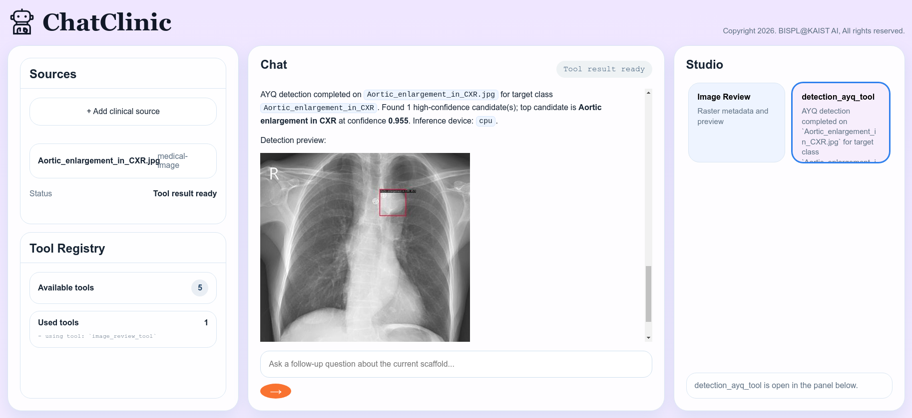

# AYQ Detection - ChatClinic Plugin

**Team:** BISPL (BioImaging, Signal Processing, & machine Learning) Lab, KAIST AI

Medical object detection tool based on the following tools and papers:
- MMDetection: Open MMLab Detection Toolbox and Benchmark  
[](https://arxiv.org/abs/1906.07155)
[](https://mmdetection.readthedocs.io/en/latest/)
- DINO: DETR with Improved DeNoising Anchor Boxes for End-to-End Object Detection  
[](https://arxiv.org/abs/2203.03605)
[](https://github.com/IDEA-Research/DINO)
- Align Your Query: Representation Alignment for Multimodality Medical Object Detection  
[](https://arxiv.org/abs/2510.02789)
[](https://araseo.github.io/alignyourquery/)


## Plugin Structure

```
plugins/detection_ayq_tool/
├── tool.json                    # ChatClinic tool manifest
├── run.py                       # Entrypoint (--input / --output)
├── requirements.txt
├── README.md
├── assets/
├── ayq_runtime/
│   ├── mmdet/                   # Modified MMDetection Toolbox
│   └── text_embeddings/         # Precomputed text embeddings
├── checkpoints/
│   └── dino_ayq_ckpt_here.txt   # Legacy placeholder
├── configs/
│   └── dino_ayq_config.py       # Detector config file
├── demo/
│   └── image_demo.py            # Called by run.py for detection
├── runtime_outputs/             # Detection outputs
├── samples/                     # Sample images
└── scripts/
```
Download the `dino_ayq.pth` checkpoint from [this Google Drive link](https://drive.google.com/file/d/1YQVADnQL9pSTls9SuJn9ihEESVOZedUr/view?usp=sharing) and place it at `./ckpt_and_file/detection_ayq_tool/dino_ayq.pth`.

## Example Usage



## Environment Setup: Conda Environment
Set up the conda environment for the AYQ Detection plugin.
```bash
conda env create -f ayq_requirements.yml
conda activate ayq
```

If the `ayq` environment has not been created yet, ChatClinic will also try to create or update it automatically from `./ayq_requirements.yml` the first time `detection_ayq_tool` needs to run inference.
Set `AYQ_AUTO_INSTALL=0` to disable this automatic install behavior.

## Environment Setup: Runtime Selection
The plugin now resolves the bundled `ayq_runtime` folder automatically and selects GPU when CUDA is available. Environment variables are only needed when you want to override the default runtime, Python environment, or device.
```bash
# Optional overrides.
export AYQ_PYTHON_EXECUTABLE="/path/to/anaconda3/envs/ayq/bin/python"
export AYQ_DEVICE=cpu
uvicorn app.main:app --host 127.0.0.1 --port 8010 --reload
```

> **Note:**
> If `AYQ_PYTHON_EXECUTABLE` is not set, the plugin searches the current Python environment first and then common `ayq` conda environment locations. The selected Python must have torch, mmengine, mmcv, mmdet, pycocotools, scipy, shapely, terminaltables, Pillow, OpenCV, and numpy installed.
